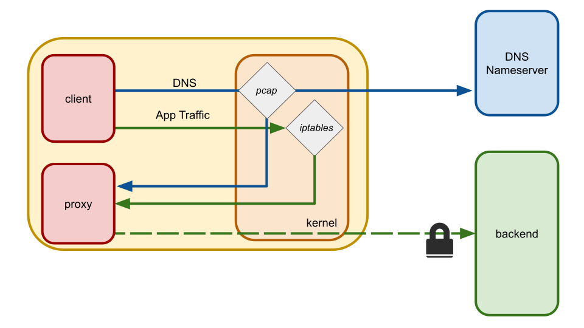

# tls-tproxy

TLS tproxy is a _transparent_ proxy which wraps plaintext TCP connections with mutual TLS. This allows you to run a single proxy process that can route connections to any number of different backend services. For example, this proxy would allow an unmodified database client that doesn't know how to use (mutual) TLS to connect to any number of database that require client authentication.

The primary use-case for this tool is to enable use of tools that cannot do mutual TLS (either because they lack an implementation or the implementation is incomplete) to operate without changes, even if they talk to multiple different backends, each with their own TLS certificate.

## Usage

Suppose you have services listening on port 443 which require mutual TLS authentication and which present publicly trusted server certificates. You can start `tls-tproxy` with a command such as:

```bash
sudo tls-tproxy --cert client.crt --key client.key --portMap 8443:443
```

Now whenever a client makes a connection to any hostname using port 8433, it will transparently be rerouted through the proxy process and sent to port 443. For example:

```bash
curl http://my-secure-service.example.com:8443/do-the-thing
```

Note that the rewriting of port numbers is not required (but it can be convenient as a way to denote what traffic needs to be proxied). If you want to add client authentication to all connections on port 443 you can instead use `--portMap 443:443`.

# How it works



tls-tproxy creates an IP tables rule to redirect outbound traffic (which can be limited to particular port(s) or to traffic from a particular user) to the proxy process. Using the `SO_ORIGINAL_DST` socket feature, the proxy can determine the original destination and create the proxy tunnel.

The biggest challenge is determining what server name to expect in the server certificate so that the TLS tunnel can be properly fully authenticated. The proxy only knows the IP of the target. To figure out what DNS name was used to connect to the target, the proxy uses pcap to sniff for DNS traffic and keeps a cache of DNS name resolutions made on the system. This allows the proxy to build a reverse map from the IP to possible DNS names the client used.

**This trick is fragile and carries security risk with it.** This tool should not be used in contexts that are highly security sensitive. Please use your discretion.

# Plugins

This project supports a plugin model for customizing how server certificates are verified. Check out the [san_verifier](plugins/san-verifier/san_verifier_plugin.go) plugin for an example of how to build a plugin. Critically, a plugin should call `plugin.Register(...)` in its `init()` function to register the plugin when the package is imported.

In the Go module where you have created your plugins, you can create a package that builds the executable with your plugins by importing the packages and calling `cmd.Main()`. For example:

```go
package main

import (
	"github.com/jackofmosttrades/tls-tproxy/cmd"
	_ "git.example.com/custom-tls-tproxy/plugins/my-awesome-plugin"
)

func main() {
	cmd.Main()
}
```